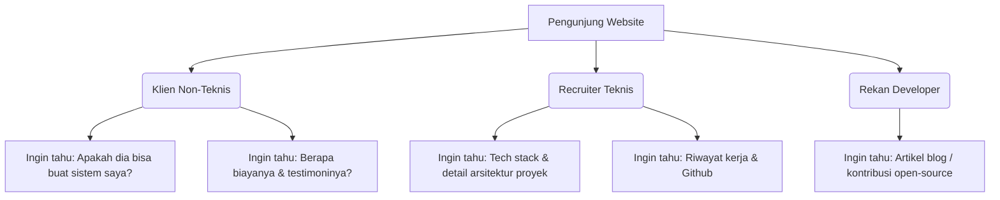

# Product Requirement Document (PRD): Portofolio Freelance Programmer

> [!NOTE]
> Dokumen ini dirancang untuk mendefinisikan kebutuhan produk, fitur utama, arsitektur informasi, serta aspek desain estetika dari website Portofolio Freelance Programmer yang modern dan premium.

---

## 1. Pendahuluan & Latar Belakang

Sebagai seorang *freelance programmer*, memiliki identitas digital yang profesional sangatlah krusial. Website portofolio bukan hanya sekadar kartu nama digital, melainkan alat utama untuk membangun kepercayaan (trust), menunjukkan kompetensi teknis, memamerkan hasil kerja, dan mengonversi pengunjung (calon klien atau recruiter) menjadi prospek bisnis.

### 1.1 Tujuan Proyek (Goal)
Membuat website portofolio interaktif dengan performa tinggi dan desain premium untuk memikat calon klien, menyajikan proyek secara terstruktur, dan mempermudah proses kontak/pemesanan jasa.

### 1.2 Target Audiens
1. **Pemilik Bisnis / Pendiri Startup (Non-Teknis)**: Mencari solusi atas masalah bisnis mereka (butuh web, aplikasi, atau otomatisasi) tanpa harus memahami bahasa pemrograman yang rumit.
2. **Manajer Proyek / Recruiter (Teknis/Semi-Teknis)**: Mencari talenta dengan spesifikasi teknologi tertentu (misal: React, Node.js, Python) untuk proyek jangka pendek maupun panjang.
3. **Komunitas Developer**: Untuk berjejaring, berbagi pengetahuan (melalui blog), dan membangun kredibilitas.

---

## 2. Kebutuhan Pengguna (User Personas)

---

## 3. Fitur Utama & Kebutuhan Fungsional

### 3.1 Hero & Headline Section (Pintu Utama)
*   **Headline yang Menarik**: Penjelasan singkat tentang keahlian utama dan nilai tambah (value proposition) yang ditawarkan (contoh: *"Membantu bisnis Anda tumbuh dengan aplikasi web yang cepat, aman, dan berdesain premium."*).
*   **Call-to-Action (CTA)**: Tombol utama yang menonjol untuk memandu pengguna langsung ke halaman Kontak atau portofolio proyek.
*   **Unduh CV/Resume**: Tombol interaktif untuk mengunduh Resume dalam format PDF.
*   **Animasi Mikro**: Efek animasi ketik (typing effect) atau grafis 3D/vektor interaktif yang tidak membebani performa.

### 3.2 About Me & Tech Stack
*   **Profil Profesional**: Cerita singkat mengenai latar belakang, filosofi kerja, dan pendekatan dalam menyelesaikan masalah.
*   **Tech Stack Interaktif**: Visualisasi teknologi yang dikuasai (Frontend, Backend, Database, Cloud) menggunakan ikon resmi yang elegan dengan efek hover (misal: JavaScript, React, Node.js, PostgreSQL, AWS).
*   **Statistik Singkat**: Counter interaktif untuk metrik penting (contoh: `3+ Tahun Pengalaman`, `20+ Proyek Selesai`, `99% Klien Puas`).

### 3.3 Portofolio & Showcases (Fitur Kunci)
*   **Sistem Filter Proyek**: Pengguna dapat memfilter proyek berdasarkan kategori (Web App, Mobile App, Automations, API Integration).
*   **Kartu Proyek Premium**: Setiap proyek ditampilkan dalam kartu dengan transisi halus, menampilkan gambar mockup berkualitas tinggi.
*   **Detail Proyek Modul/Detail Page**:
    *   Deskripsi tantangan/masalah klien dan bagaimana programmer menyelesaikannya.
    *   Teknologi yang digunakan (tagging).
    *   Tautan langsung ke versi demo langsung (Live Demo) dan kode sumber (GitHub) jika bersifat open source.
    *   Peran dan kontribusi spesifik programmer dalam proyek tersebut.

### 3.4 Layanan & Estimasi Harga (Services & Pricing)
*   **Paket/Jenis Layanan**: Penjelasan jelas tentang apa saja yang ditawarkan (misalnya: *Landing Page Development*, *Full-stack Web Application*, *API Integration & Bug Fixing*).
*   **Estimasi Harga/Proses Kerja**: Alur kerja transparan mulai dari konsultasi, desain, pengembangan, hingga rilis untuk memberikan gambaran profesional kepada klien non-teknis.

### 3.5 Testimoni & Bukti Sosial (Social Proof)
*   **Ulasan Klien**: Carousel testimonial dari klien yang pernah dilayani, lengkap dengan nama, jabatan, logo perusahaan, dan foto profil.
*   **Kutipan Proyek Terkenal**: Untuk proyek berskala besar yang memiliki dampak nyata.

### 3.6 Kontak Terintegrasi & Call to Action Akhir
*   **Formulir Kontak**: Input Nama, Email, Subjek, dan Pesan dengan validasi *real-time* dan proteksi spam (misal: honeypot atau Cloudflare Turnstile).
*   **Saluran Kontak Langsung**: Tautan langsung ke WhatsApp (dengan pesan pembuka otomatis), Telegram, Email profesional, dan platform profesional lainnya (LinkedIn, GitHub).

---

## 4. Kebutuhan Non-Fungsional (Kualitas & Performa)

### 4.1 Performa & SEO (Search Engine Optimization)
*   **Kecepatan Pemuatan**: Skor Google Lighthouse minimal **90+** untuk Performance, Accessibility, Best Practices, dan SEO.
*   **SEO Metadata**: Penggunaan tag Open Graph (OG), deskripsi meta dinamis, peta situs (sitemap.xml), dan robot.txt untuk memudahkan mesin pencari mengindeks website.
*   **Semantic HTML**: Penggunaan tag HTML5 (`<header>`, `<main>`, `<section>`, `<article>`, `<footer>`) secara tepat.

### 4.2 Desain Estetika Premium & UI/UX (Retro / Neo-Brutalis)
*   **Tema Retro / Neo-Brutalis**:
    *   Menggunakan elemen desain Retro Modern/Neo-Brutalisme yang kuat: garis tepi tebal (borders hitam tebal `border-4 border-black`), bayangan kaku tanpa blur (drop-shadows hitam tajam seperti `shadow-[4px_4px_0px_0px_rgba(0,0,0,1)]`), grid berpola dot/garis, serta komponen bergaya OS jadul (retro Windows 95/classic Mac atau terminal retro).
*   **Skema Warna Retro**:
    *   *Dark Mode*: Latar belakang abu-abu terminal (`#121212` atau `#1e1e1e`) dengan aksen warna hijau fosfor (`#39ff14`), kuning amber (`#ffb000`), atau biru neon.
    *   *Light Mode*: Latar belakang kuning gading / kertas tua (`#f4f0ec` atau `#fdf6e3`) dengan kombinasi warna pastel tegas (Teal, Oranye retro, atau Ungu retro) dan kontras tinggi.
*   **Tipografi Retro Premium**: Menggunakan font monospace atau sans-serif bergaya retro (seperti *VT323*, *Share Tech Mono*, atau *Space Grotesk* dari Google Fonts) untuk memberikan kesan teknologi klasik namun tetap nyaman dibaca.
*   **Animasi & Interaksi Retro**: Efek ketikan terminal (typing effect), efek flicker CRT monitor (opsional, halus), kursor kustom retro, dan efek tombol yang tertekan nyata secara fisik ketika di-klik.

### 4.3 Responsivitas
*   Desain responsif yang bekerja sempurna di perangkat Mobile (smartphone), Tablet, hingga Layar Desktop beresolusi tinggi (4K).

---

## 5. Rencana Tumpukan Teknologi (Technology Stack)

| Komponen | Pilihan Utama | Alternatif |
| :--- | :--- | :--- |
| **Framework Frontend** | Vue 3 (Vite) / Nuxt.js | React / Vite |
| **Bahasa Pemrograman** | TypeScript / JavaScript | JavaScript |
| **Styling & CSS** | Tailwind CSS | Vanilla CSS / CSS Modules |
| **Library Animasi** | Vue Transition / GSAP / CSS | Tailwind Animations |
| **Form Handling** | Standard Vue Binding + Formspree / Web3Forms | Vuelidate / VeeValidate |
| **Hosting & Deployment** | Vercel / Netlify | GitHub Pages / cPanel |

---

## 6. Struktur Menu & Peta Situs (Sitemap - Single Page Layout)

Website ini dirancang sepenuhnya sebagai **Single Page Application (SPA)** yang interaktif. Navigasi navbar akan mengarahkan pengguna (smooth scroll) ke bagian tertentu pada halaman utama.

*   ` / ` (Beranda Utama - Single Page Layout)
    *   **Hero Section**: Headline retro, deskripsi singkat, tombol CTA utama, dan unduh CV/Resume.
    *   **About Me**: Deskripsi personal dan statistik performa (metrik dengan box bergaya retro OS).
    *   **Tech Stack**: Visualisasi skill menggunakan ikon retro atau pixel art dengan efek hover yang responsif.
    *   **Projects Gallery**: Galeri proyek dengan sistem filter kategori. Detail proyek ditampilkan menggunakan **Modal/Pop-up interaktif** bergaya window OS klasik (dengan tombol minimize/close di pojok atas) tanpa harus berpindah halaman.
    *   **Services & Pricing**: Penjelasan jasa dan estimasi harga dalam format kartu Neo-Brutalis.
    *   **Testimonial**: Slider ulasan klien dengan gaya retro chat bubble.
    *   **Contact Form**: Formulir kontak terintegrasi dengan gaya input retro yang tebal dan tombol kirim interaktif.

---

## 7. Rencana Rilis & Milestone Pengembangan

1.  **Fase 1: Perencanaan & Wireframing (Hari 1-2)**
    *   Menyetujui PRD ini.
    *   Membuat rancangan tata letak dasar (wireframe) kasar.
2.  **Fase 2: Setup Awal & Desain Sistem (Hari 3)**
    *   Inisialisasi project dengan Vue 3 (Vite) + Tailwind CSS.
    *   Konfigurasi tema warna (Dark/Light mode) dan font.
3.  **Fase 3: Pengembangan UI Komponen Dasar (Hari 4-6)**
    *   Membuat komponen Navbar, Footer, Hero, dan About.
    *   Menerapkan visualisasi Tech Stack dan integrasi ikon.
4.  **Fase 4: Pengembangan Fitur Interaktif (Hari 7-9)**
    *   Membuat galeri proyek dengan filter kategori.
    *   Integrasi modal detail proyek.
    *   Menghubungkan form kontak dengan layanan pengirim email.
5.  **Fase 5: Pengujian, Optimasi, & Peluncuran (Hari 10)**
    *   Optimasi performa gambar dan bundle size.
    *   Uji coba responsivitas di berbagai perangkat.
    *   Pengujian SEO & aksesibilitas menggunakan Lighthouse.
    *   Deployment ke platform Vercel.
